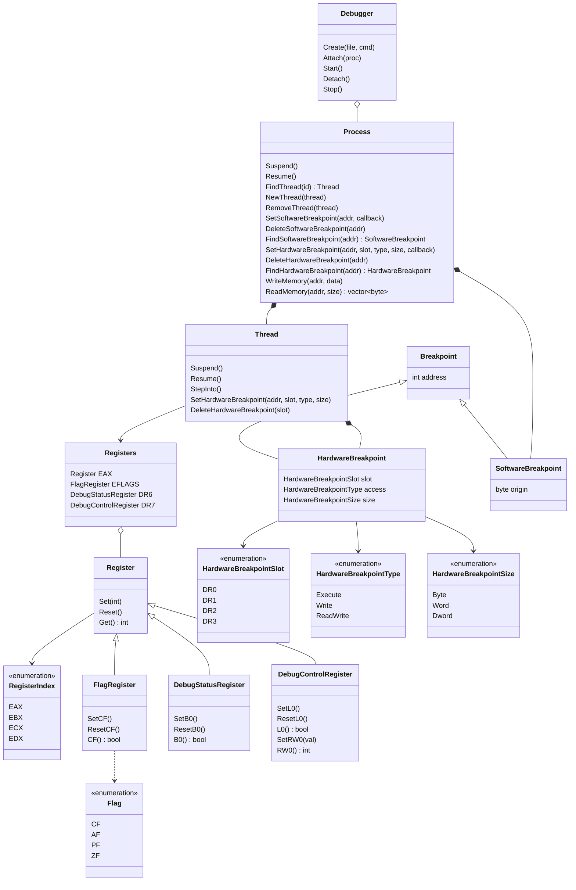

# Windows x86 Debugger


[](https://cmake.org)
[](https://visualstudio.microsoft.com/)
[](https://www.microsoft.com/en-ie/windows)


## Introduction


A tiny **Windows x86** debugging framework written in *C++20* that supports software breakpoints and hardware breakpoints. It can be used to create custom debuggers. Some design patterns came from [*GleeBug*](https://github.com/x64dbg/GleeBug).

## Getting Started

### Prerequisites

- Install [*Visual Studio 2022*](https://visualstudio.microsoft.com).
- Install [*CMake*](https://cmake.org).
- Set the `PATH` environment variables.

### Building

Set the location to the project folder and run:

```bash
mkdir -p build
cd build
cmake .. -G "Visual Studio 17 2022" -A Win32
cmake --build .
```

## Usage

Users can create derived classes inheriting from `Debugger` class and override or implement provided event callbacks.

- `Debugger` does not provide any implementation for event callbacks whose names start with `cb`.
- `Debugger` provides the basic implementation for event callbacks whose names start with `On`.

```c++
class MyDebugger : public Debugger {
private:
    void cbCreateProcess(const CREATE_PROCESS_DEBUG_INFO& details,
                         const Process& process) override {
        std::cout << std::format("The process {} has been created.",
                                 process.Id())
                  << std::endl;
    }

    void cbExitProcess(const EXIT_PROCESS_DEBUG_INFO& details,
                       const Process& process) override {
        std::cout << std::format("The process {} has exited.",
                                 process.Id())
                  << std::endl;
    }
};
```

## Documents

Code comments follow [*Doxygen*](https://www.doxygen.nl) specification.

### Class Diagram



## License

Distributed under the *MIT License*. See `LICENSE` for more information.

## Contact

- ***Chen Zhenshuo***

  > ***GitHub***: https://github.com/czs108
  >
  > ***E-Mail***: chenzs108@outlook.com
  >
  > ***WeChat***: chenzs108

- ***Liu Guowen***

  > ***GitHub***: https://github.com/lgw1995
  >
  > ***E-Mail***: liu.guowen@outlook.com